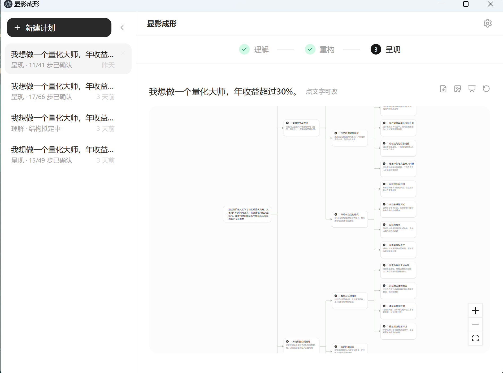
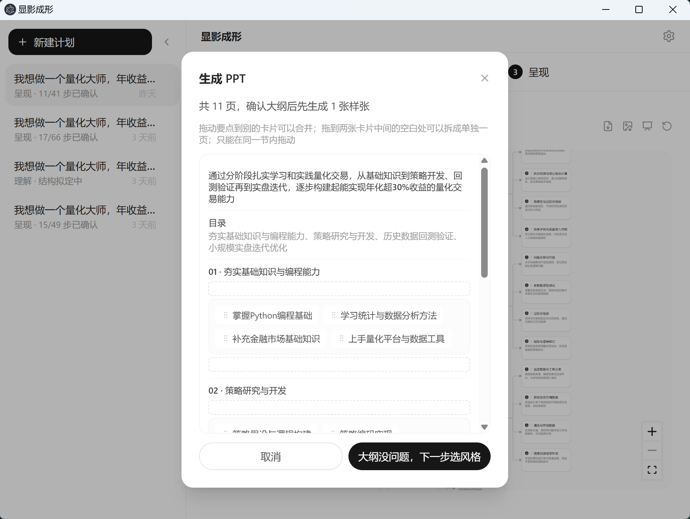

<p align="center">
  
</p>

# thinkppt

做 PPT 真正的门槛不是排版，是**想清楚**：重点是什么、给谁讲、怎么排才讲得通。thinkppt 就做这一件事——让领导听他想听的。职场汇报、学术答辩都适用。

差别看个例子：**给领导讲一件事做完了**。

现有的 AI 生成 PPT，通常 30 秒出 20 页，逻辑全靠 AI 猜。好看是真好看，但领导一问"这结果从哪来？前后什么关系？"——答不上来。

thinkppt：先问你几个问题，把你的话理成结构树，逐条确认后才成稿。重点是什么、每页为什么在，你心里有数。

| | 一句话生成 | thinkppt |
|---|---|---|
| 逻辑从哪来 | AI 猜的，好看但空 | 你确认过的，站得住 |
| 被领导追问 | 答不上来 | 每页为什么在，你都知道 |
| 能不能改 | 一动就散 | 结构在本地，随时改 |
| 隔几天回来 | 得重新生成 | 打开接着理 |

## 怎么用

1. 说个大概（可选：附上参考文件，会导入文字）
2. 想清楚——AI 逐条问你几个问题，把你的话整理成结构
3. 确认——在结构树里逐层看、逐条改，改到站得住
4. 成稿——一键导出 PPT、Markdown 或结构图

适合：工作汇报、项目复盘、方案汇报、毕业答辩。

## 界面

<p align="center">
  
  <br />
  
  <br />
  
  <br />
  
</p>

## 技术栈

Electron + React + TypeScript + Tailwind。AI 可插拔（OpenAI / Claude / DeepSeek），API Key 只存本机。

## 开发

```bash
npm install
npm run dev        # 启动开发模式
npm run build      # 打包生产版本
npm run typecheck  # 类型检查
```

## 致谢

PPT 视觉风格库来自 [codex-ppt-skill](https://github.com/ningzimu/codex-ppt-skill)（MIT License，Copyright (c) 2026 ningzimu）。

## License

MIT
